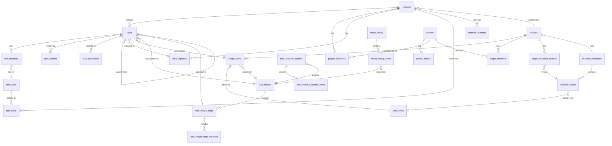

# DATABASE SCHEMA REFERENCE

> Complete schema reference for the Contractor App PostgreSQL database (Supabase / Lovable Cloud).

---

## Entity-Relationship Diagram

---

## Tables

### profiles

User identity and global permissions.

| Column | Type | Nullable | Default | Notes |
|---|---|---|---|---|
| **id** | uuid | No | — | PK, matches `auth.users.id` |
| full_name | text | Yes | — | |
| is_admin | boolean | No | false | Global admin flag |
| can_manage_projects | boolean | No | false | Can create projects/scopes |
| created_at | timestamptz | No | now() | |

---

### profile_aliases

Alternate names for AI user-matching.

| Column | Type | Nullable | Default | Notes |
|---|---|---|---|---|
| **id** | uuid | No | gen_random_uuid() | PK |
| user_id | uuid | No | — | FK → profiles.id |
| alias | text | No | — | |
| created_at | timestamptz | No | now() | |

---

### projects

Construction projects.

| Column | Type | Nullable | Default | Notes |
|---|---|---|---|---|
| **id** | uuid | No | gen_random_uuid() | PK |
| name | text | No | — | |
| address | text | Yes | — | |
| status | enum project_status | No | 'active' | active / paused / complete |
| scope_id | uuid | Yes | — | FK → scopes.id |
| has_missing_estimates | boolean | No | false | |
| created_at | timestamptz | No | now() | |
| updated_at | timestamptz | No | now() | |

---

### project_members

User membership in projects.

| Column | Type | Nullable | Default | Notes |
|---|---|---|---|---|
| **id** | uuid | No | gen_random_uuid() | PK |
| project_id | uuid | No | — | FK → projects.id |
| user_id | uuid | No | — | FK → profiles.id |
| role | enum project_member_role | No | 'contractor' | contractor / manager / read_only |
| created_at | timestamptz | No | now() | |

---

### scopes

Property inspection and estimation records.

| Column | Type | Nullable | Default | Notes |
|---|---|---|---|---|
| **id** | uuid | No | gen_random_uuid() | PK |
| name | text | Yes | — | |
| address | text | No | — | |
| status | enum scope_status | No | 'active' | active / archived / Draft / Converted / Archived |
| created_by | uuid | No | — | |
| checklist_template_id | uuid | Yes | — | FK → checklist_templates.id |
| converted_at | timestamptz | Yes | — | |
| converted_project_id | uuid | Yes | — | FK → projects.id |
| estimated_total_snapshot | numeric | Yes | — | Captured at conversion |
| baseline_locked_at | timestamptz | Yes | — | |
| created_at | timestamptz | No | now() | |
| updated_at | timestamptz | No | now() | |

---

### scope_items

Individual line items within a scope.

| Column | Type | Nullable | Default | Notes |
|---|---|---|---|---|
| **id** | uuid | No | gen_random_uuid() | PK |
| scope_id | uuid | No | — | FK → scopes.id |
| description | text | No | — | |
| status | text | No | 'Not Checked' | Not Checked / OK / Repair / Replace / Get Bid |
| notes | text | Yes | — | |
| qty | numeric | Yes | — | |
| unit | text | Yes | — | |
| unit_cost_override | numeric | Yes | — | |
| computed_total | numeric | Yes | — | qty × unit_cost_override |
| cost_item_id | uuid | Yes | — | FK → cost_items.id |
| recipe_hint_id | uuid | Yes | — | FK → task_recipes.id |
| phase_key | text | Yes | — | demo / rough / finish |
| pricing_status | enum pricing_status | No | 'Needs Pricing' | Priced / Needs Pricing |
| estimated_hours | numeric | Yes | — | |
| estimated_labor_cost | numeric | Yes | — | |
| estimated_material_cost | numeric | Yes | — | |
| added_after_conversion | boolean | No | false | |
| created_at | timestamptz | No | now() | |
| updated_at | timestamptz | No | now() | |

---

### scope_members

User membership in scopes.

| Column | Type | Nullable | Default | Notes |
|---|---|---|---|---|
| **id** | uuid | No | gen_random_uuid() | PK |
| scope_id | uuid | No | — | FK → scopes.id |
| user_id | uuid | No | — | FK → profiles.id |
| role | enum scope_member_role | No | 'editor' | viewer / editor / manager |
| created_at | timestamptz | No | now() | |

---

### scope_checklist_reviews

Per-scope review state for checklist items.

| Column | Type | Nullable | Default | Notes |
|---|---|---|---|---|
| **id** | uuid | No | gen_random_uuid() | PK |
| scope_id | uuid | No | — | FK → scopes.id |
| checklist_item_id | uuid | No | — | FK → checklist_items.id |
| state | text | No | — | |
| notes | text | Yes | — | |
| updated_at | timestamptz | No | now() | |

---

### tasks

Individual work items.

| Column | Type | Nullable | Default | Notes |
|---|---|---|---|---|
| **id** | uuid | No | gen_random_uuid() | PK |
| project_id | uuid | No | — | FK → projects.id |
| task | text | No | — | Task title |
| stage | enum task_stage | No | 'Ready' | Ready / In Progress / Not Ready / Hold / Done |
| priority | enum task_priority | No | '2 – This Week' | 5 levels |
| materials_on_site | enum materials_status | No | 'No' | Yes / Partial / No |
| trade | text | Yes | — | |
| room_area | text | Yes | — | |
| notes | text | Yes | — | |
| due_date | date | Yes | — | |
| sort_order | integer | Yes | — | |
| assignment_mode | text | No | 'solo' | solo / crew |
| assigned_to_user_id | uuid | Yes | — | Solo assignment |
| lead_user_id | uuid | Yes | — | Crew lead |
| claimed_by_user_id | uuid | Yes | — | FK → profiles.id |
| claimed_at | timestamptz | Yes | — | |
| started_by_user_id | uuid | Yes | — | FK → profiles.id |
| started_at | timestamptz | Yes | — | |
| completed_at | timestamptz | Yes | — | |
| actual_total_cost | numeric | Yes | — | Admin-only |
| parent_task_id | uuid | Yes | — | FK → tasks.id |
| source_scope_item_id | uuid | Yes | — | FK → scope_items.id |
| source_recipe_id | uuid | Yes | — | FK → task_recipes.id |
| source_recipe_step_id | uuid | Yes | — | FK → task_recipe_steps.id |
| expanded_recipe_id | uuid | Yes | — | FK → task_recipes.id |
| recipe_hint_id | uuid | Yes | — | FK → task_recipes.id |
| field_capture_id | uuid | Yes | — | FK → field_captures.id |
| bundles_applied | boolean | No | false | |
| needs_manager_review | boolean | No | false | |
| created_by | uuid | No | — | |
| created_at | timestamptz | No | now() | |
| updated_at | timestamptz | No | now() | |

---

### task_materials

Materials and tools needed for tasks.

| Column | Type | Nullable | Default | Notes |
|---|---|---|---|---|
| **id** | uuid | No | gen_random_uuid() | PK |
| task_id | uuid | No | — | FK → tasks.id |
| name | text | No | — | |
| item_type | text | No | 'material' | material / tool |
| quantity | numeric | Yes | — | |
| unit | text | Yes | — | |
| sku | text | Yes | — | |
| vendor_url | text | Yes | — | |
| store_section | text | Yes | — | |
| store_section_manual | boolean | No | false | |
| provided_by | text | No | 'either' | |
| purchased | boolean | No | false | |
| delivered | boolean | No | false | |
| confirmed_on_site | boolean | No | false | |
| is_active | boolean | No | true | Soft delete |
| tool_type_id | uuid | Yes | — | FK → tool_types.id |
| created_at | timestamptz | No | now() | |

---

### task_workers

Crew labor tracking.

| Column | Type | Nullable | Default | Notes |
|---|---|---|---|---|
| task_id | uuid | No | — | PK (composite), FK → tasks.id |
| user_id | uuid | No | — | PK (composite) |
| active | boolean | No | true | |
| joined_at | timestamptz | No | now() | |
| left_at | timestamptz | Yes | — | |

---

### task_candidates

Users eligible to join crew tasks.

| Column | Type | Nullable | Default | Notes |
|---|---|---|---|---|
| task_id | uuid | No | — | PK (composite), FK → tasks.id |
| user_id | uuid | No | — | PK (composite) |

---

### task_recipes

Reusable task playbooks.

| Column | Type | Nullable | Default | Notes |
|---|---|---|---|---|
| **id** | uuid | No | gen_random_uuid() | PK |
| name | text | No | — | |
| trade | text | Yes | — | |
| keywords | text[] | Yes | '{}' | For matching |
| active | boolean | No | true | |
| is_repeatable | boolean | No | false | |
| estimated_cost | numeric | Yes | — | |
| last_actual_avg | numeric | Yes | — | |
| last_actual_count | integer | No | 0 | |
| created_by | uuid | No | — | |
| created_at | timestamptz | No | now() | |
| updated_at | timestamptz | No | now() | |

---

### task_recipe_steps

Steps within a recipe.

| Column | Type | Nullable | Default | Notes |
|---|---|---|---|---|
| **id** | uuid | No | gen_random_uuid() | PK |
| recipe_id | uuid | No | — | FK → task_recipes.id |
| title | text | No | — | |
| sort_order | integer | No | — | |
| trade | text | Yes | — | |
| notes | text | Yes | — | |
| is_optional | boolean | No | false | |
| created_by | uuid | Yes | — | |
| created_at | timestamptz | No | now() | |

---

### task_recipe_step_materials

Material templates for recipe steps.

| Column | Type | Nullable | Default | Notes |
|---|---|---|---|---|
| **id** | uuid | No | gen_random_uuid() | PK |
| recipe_step_id | uuid | No | — | FK → task_recipe_steps.id |
| material_name | text | No | — | |
| qty | numeric | Yes | — | |
| qty_formula | text | Yes | — | e.g. 'room_sqft / 32' |
| unit | text | Yes | — | |
| sku | text | Yes | — | |
| vendor_url | text | Yes | — | |
| store_section | text | Yes | — | |
| provided_by | text | Yes | 'either' | |
| notes | text | Yes | — | |
| created_at | timestamptz | No | now() | |

---

### task_material_bundles

Keyword-matched material sets.

| Column | Type | Nullable | Default | Notes |
|---|---|---|---|---|
| **id** | uuid | No | gen_random_uuid() | PK |
| name | text | No | — | |
| trade | text | Yes | — | |
| keywords | text[] | Yes | '{}' | |
| active | boolean | No | true | |
| priority | integer | No | 100 | Lower = higher priority |
| recipe_id | uuid | Yes | — | FK → task_recipes.id |
| created_by | uuid | No | — | |
| created_at | timestamptz | No | now() | |
| updated_at | timestamptz | No | now() | |

---

### task_material_bundle_items

Items within a material bundle.

| Column | Type | Nullable | Default | Notes |
|---|---|---|---|---|
| **id** | uuid | No | gen_random_uuid() | PK |
| bundle_id | uuid | No | — | FK → task_material_bundles.id |
| material_name | text | No | — | |
| qty | numeric | Yes | — | |
| unit | text | Yes | — | |
| sku | text | Yes | — | |
| vendor_url | text | Yes | — | |
| store_section | text | Yes | — | |
| provided_by | text | Yes | 'either' | |
| created_at | timestamptz | No | now() | |

---

### field_captures

Raw text + AI output from field mode sessions.

| Column | Type | Nullable | Default | Notes |
|---|---|---|---|---|
| **id** | uuid | No | gen_random_uuid() | PK |
| project_id | uuid | No | — | FK → projects.id |
| created_by | uuid | No | — | |
| raw_text | text | No | — | |
| include_materials | boolean | No | true | |
| parse_status | text | No | 'pending' | |
| ai_output | jsonb | Yes | — | |
| error | text | Yes | — | |
| created_at | timestamptz | No | now() | |

---

### rehab_library

Trade-specific scope templates.

| Column | Type | Nullable | Default | Notes |
|---|---|---|---|---|
| **id** | uuid | No | gen_random_uuid() | PK |
| name | text | No | — | e.g. "Bathroom Rehab" |
| category | text | Yes | — | |
| keywords | text[] | Yes | — | For AI matching |
| active | boolean | No | true | |
| created_by | uuid | No | — | |
| created_at | timestamptz | No | now() | |
| updated_at | timestamptz | No | now() | |

---

### rehab_library_items

Pre-defined scope items within a rehab template.

| Column | Type | Nullable | Default | Notes |
|---|---|---|---|---|
| **id** | uuid | No | gen_random_uuid() | PK |
| library_id | uuid | No | — | FK → rehab_library.id |
| description | text | No | — | |
| default_status | text | No | 'Repair' | |
| trade | text | Yes | — | |
| recipe_hint_id | uuid | Yes | — | FK → task_recipes.id |
| sort_order | integer | No | 0 | |
| created_at | timestamptz | No | now() | |

---

### cost_items

Global cost/pricing reference library.

| Column | Type | Nullable | Default | Notes |
|---|---|---|---|---|
| **id** | uuid | No | gen_random_uuid() | PK |
| name | text | No | — | |
| normalized_name | text | Yes | — | For fuzzy matching |
| default_total_cost | numeric | No | 0 | |
| unit_type | enum unit_type | No | 'each' | each / sqft / lf / piece |
| piece_length_ft | numeric | Yes | — | |
| active | boolean | No | true | |
| created_at | timestamptz | No | now() | |
| updated_at | timestamptz | No | now() | |

---

### checklist_templates

Named inspection checklists.

| Column | Type | Nullable | Default | Notes |
|---|---|---|---|---|
| **id** | uuid | No | gen_random_uuid() | PK |
| name | text | No | — | |
| active | boolean | No | true | |
| created_at | timestamptz | No | now() | |
| updated_at | timestamptz | No | now() | |

---

### checklist_items

Individual items in a checklist template.

| Column | Type | Nullable | Default | Notes |
|---|---|---|---|---|
| **id** | uuid | No | gen_random_uuid() | PK |
| template_id | uuid | No | — | FK → checklist_templates.id |
| label | text | No | — | |
| normalized_label | text | No | — | For matching |
| category | text | Yes | — | |
| default_cost_item_id | uuid | Yes | — | FK → cost_items.id |
| sort_order | integer | No | 0 | |
| active | boolean | No | true | |
| created_at | timestamptz | No | now() | |
| updated_at | timestamptz | No | now() | |

---

### store_sections

Store aisle/section categories.

| Column | Type | Nullable | Default | Notes |
|---|---|---|---|---|
| **id** | uuid | No | gen_random_uuid() | PK |
| name | text | No | — | |
| sort_order | integer | No | 100 | |
| is_active | boolean | No | true | |
| created_at | timestamptz | No | now() | |
| updated_at | timestamptz | No | now() | |

---

### tool_types

Tool catalog.

| Column | Type | Nullable | Default | Notes |
|---|---|---|---|---|
| **id** | uuid | No | gen_random_uuid() | PK |
| name | text | No | — | |
| sku | text | Yes | — | |
| vendor_url | text | Yes | — | |
| is_active | boolean | No | true | |
| created_at | timestamptz | No | now() | |

---

### tool_stock

Tool quantities by location.

| Column | Type | Nullable | Default | Notes |
|---|---|---|---|---|
| **id** | uuid | No | gen_random_uuid() | PK |
| tool_type_id | uuid | No | — | FK → tool_types.id |
| location_type | text | No | — | warehouse / jobsite |
| project_id | uuid | Yes | — | FK → projects.id (if on site) |
| qty | integer | No | 0 | |
| updated_by | uuid | Yes | — | FK → profiles.id |
| updated_at | timestamptz | No | now() | |

---

### material_inventory

Bulk material stock.

| Column | Type | Nullable | Default | Notes |
|---|---|---|---|---|
| **id** | uuid | No | gen_random_uuid() | PK |
| name | text | No | — | |
| qty | numeric | No | — | |
| unit | text | Yes | — | |
| location_type | text | No | — | |
| project_id | uuid | Yes | — | FK → projects.id |
| status | text | No | 'available' | |
| sku | text | Yes | — | |
| vendor_url | text | Yes | — | |
| updated_by | uuid | Yes | — | FK → profiles.id |
| created_at | timestamptz | No | now() | |
| updated_at | timestamptz | No | now() | |

---

## Enums

| Enum | Values |
|---|---|
| `project_status` | active, paused, complete |
| `project_member_role` | contractor, manager, read_only |
| `scope_status` | Draft, Converted, Archived, active, archived |
| `scope_member_role` | viewer, editor, manager |
| `task_stage` | Ready, In Progress, Not Ready, Hold, Done |
| `task_priority` | 1 – Now, 2 – This Week, 3 – Soon, 4 – When Time, 5 – Later |
| `materials_status` | Yes, Partial, No |
| `pricing_status` | Priced, Needs Pricing |
| `unit_type` | each, sqft, lf, piece |

---

## Database Functions (RPC)

| Function | Returns | Purpose |
|---|---|---|
| `is_admin(uuid)` | boolean | Check admin status |
| `can_manage_projects(uuid)` | boolean | Check project management permission |
| `is_project_member(uuid, uuid)` | boolean | Check project membership |
| `get_project_role(uuid, uuid)` | project_member_role | Get role in project |
| `is_scope_member(uuid, uuid)` | boolean | Check scope membership |
| `get_scope_role(uuid, uuid)` | scope_member_role | Get role in scope |
| `expand_recipe(uuid, uuid, uuid)` | integer | Expand recipe into child tasks |
| `capture_recipe_from_task(uuid, uuid)` | jsonb | Capture task children back into recipe |

## Triggers

| Function | Purpose |
|---|---|
| `handle_new_user()` | Auto-create profile on signup; first user = admin |
| `protect_admin_flag()` | Prevent non-admin from changing admin/manager flags |
| `protect_actual_cost()` | Only admins can update actual_total_cost |
| `update_updated_at_column()` | Auto-set updated_at on row changes |
