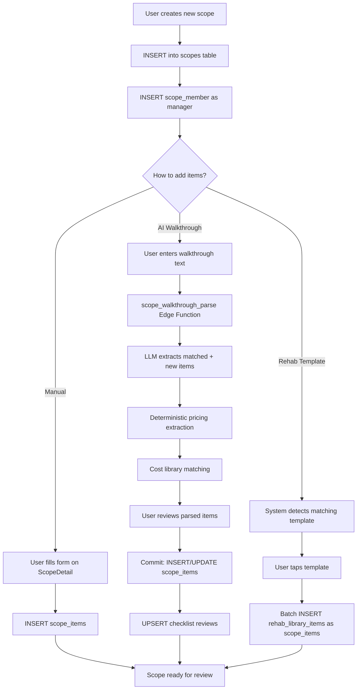
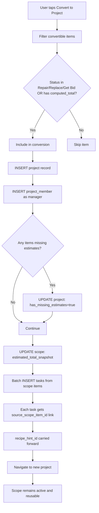
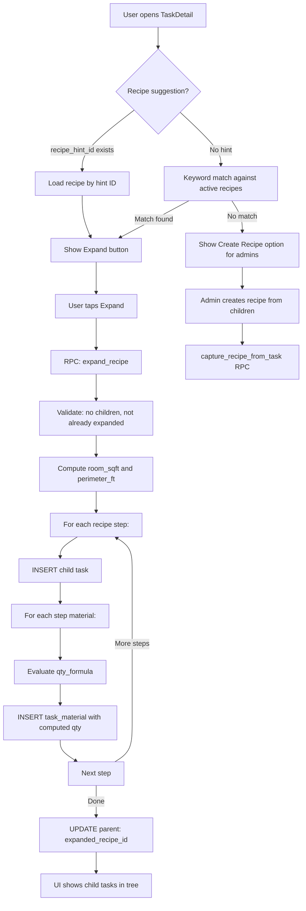
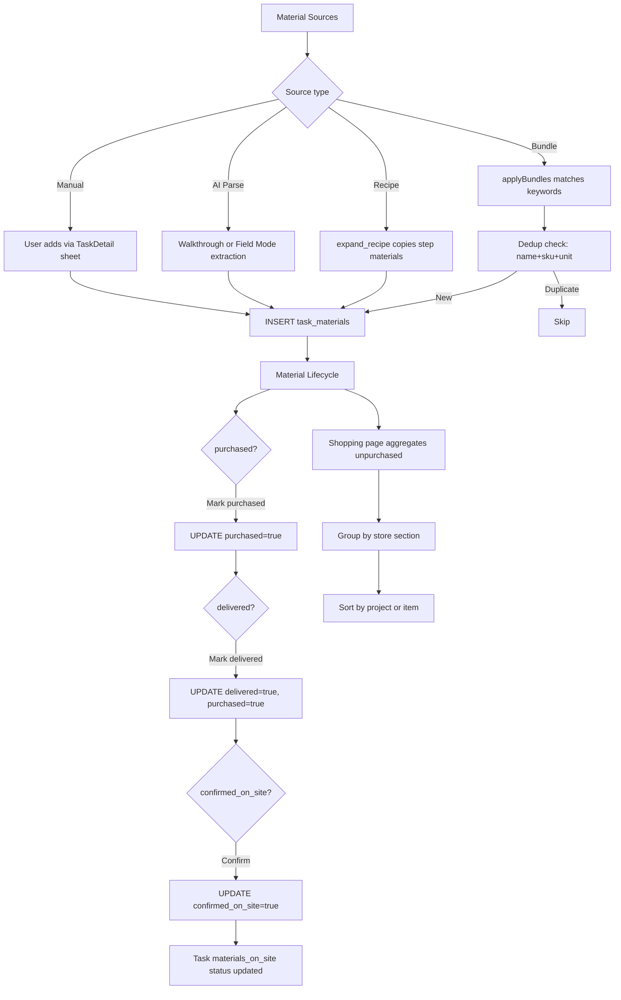
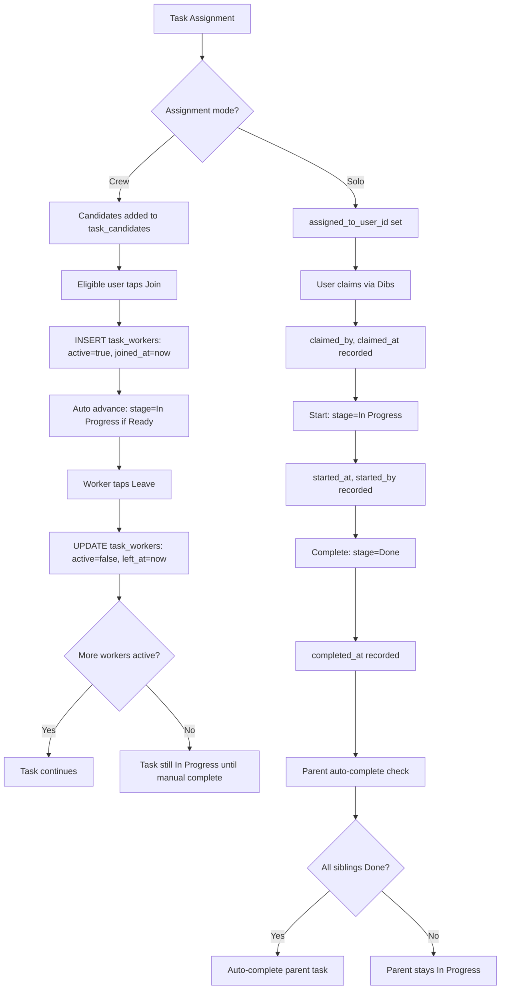
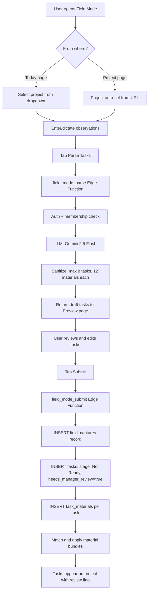
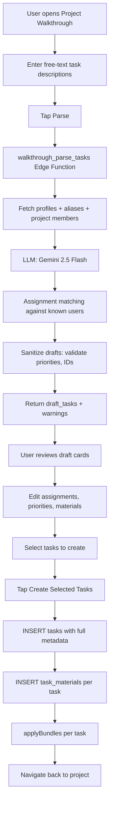
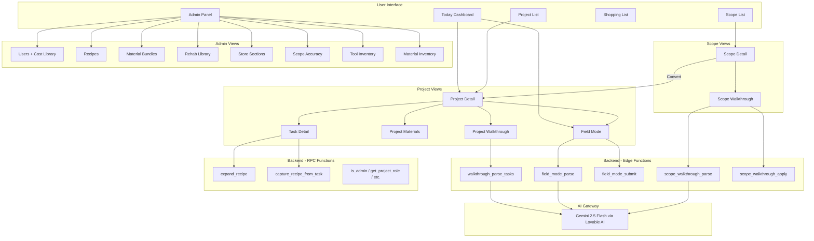
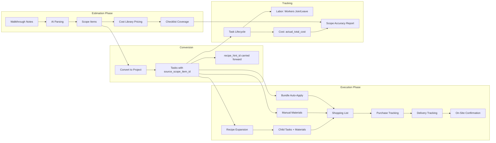
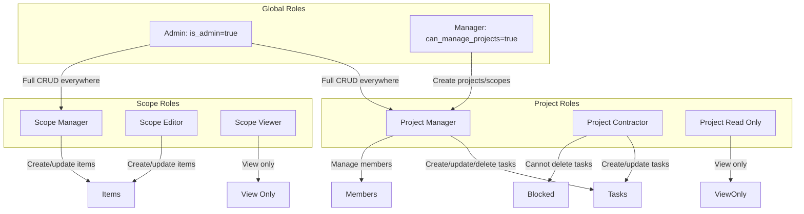

# CONTRACTOR APP — SYSTEM FLOWS

> Operational flow documentation extracted from the full codebase. Covers every major workflow with step-by-step logic, database mutations, functions involved, and UI updates.

---

## SECTION 1 — CORE WORKFLOW FLOWS

---

### 1.1 Scope Creation

**Purpose**: Create a property inspection record and populate it with scope items for estimation.

#### User Actions
1. Navigate to `/scopes` → tap **New Scope**
2. Enter address (required) and optional name
3. System creates scope record and adds user as `manager` in `scope_members`

#### Database Changes
| Step | Table | Operation | Key Fields |
|---|---|---|---|
| 1 | `scopes` | INSERT | address, name, status='active', created_by=user.id |
| 2 | `scope_members` | INSERT | scope_id, user_id, role='manager' |

#### Adding Scope Items (Manual)
1. User taps **+ Add Item** on ScopeDetail page
2. Fills in description, qty, unit, unit_cost, status, phase_key, notes
3. System computes `computed_total = qty × unit_cost_override`
4. Sets `pricing_status` to 'Priced' if unit_cost provided, else 'Needs Pricing'

| Step | Table | Operation | Key Fields |
|---|---|---|---|
| 1 | `scope_items` | INSERT | scope_id, description, qty, unit, unit_cost_override, computed_total, pricing_status, status, phase_key, notes |

#### Adding Scope Items (AI Walkthrough)
See **Section 1.7 — Scope Walkthrough Parsing** below.

#### Adding Scope Items (Rehab Template)
1. During walkthrough, system detects matching rehab templates via keyword/Jaccard matching
2. User taps a detected template → system fetches `rehab_library_items` for that template
3. Items batch-inserted into `scope_items` with description, default_status, trade, recipe_hint_id

| Step | Table | Operation | Key Fields |
|---|---|---|---|
| 1 | `rehab_library` | SELECT | Fetch active templates with keywords |
| 2 | `rehab_library_items` | SELECT | Fetch items for matched template |
| 3 | `scope_items` | INSERT (batch) | scope_id, description, status=default_status, recipe_hint_id |

#### UI Updates
- ScopeDetail page refreshes item list
- Estimated total recalculated from `computed_total` sum
- Checklist coverage percentages updated
- Unpriced count badge updated

---

### 1.2 Scope → Project Conversion

**Purpose**: Transform approved scope items into an actionable project with tasks.

#### User Actions
1. On ScopeDetail page, user taps **Convert to Project**
2. System filters convertible items: status in (Repair, Replace, Get Bid) OR items with `computed_total > 0`
3. Confirmation creates project and tasks

#### Database Changes (Sequential)

| Step | Table | Operation | Key Fields |
|---|---|---|---|
| 1 | `projects` | INSERT | name=scope.name, address=scope.address, scope_id=scope.id |
| 2 | `projects` | UPDATE (conditional) | has_missing_estimates=true (if any item lacks computed_total) |
| 3 | `project_members` | INSERT | project_id, user_id, role='manager' |
| 4 | `scopes` | UPDATE | estimated_total_snapshot = sum of all item computed_totals |
| 5 | `tasks` | INSERT (batch) | project_id, task=item.description, source_scope_item_id=item.id, recipe_hint_id=item.recipe_hint_id, stage='Ready', priority='2 – This Week', materials_on_site='No' |

#### Functions Involved
- Client-side only (no edge function). Direct Supabase SDK calls from `ScopeDetail.tsx`.

#### Key Rules
- **Scope remains active** — it is NOT archived or marked as converted (reusable blueprint pattern)
- `estimated_total_snapshot` captures the estimate at conversion time for later comparison
- `source_scope_item_id` on each task maintains a permanent link back to the scope item
- `recipe_hint_id` carries forward from scope items → tasks, enabling recipe suggestions on the project side
- The converting user becomes the project `manager`

#### UI Updates
- Navigate to new project detail page (`/projects/:id`)
- Toast: "Scope converted to project!"

---

### 1.3 Task Creation

**Purpose**: Create individual work items within a project.

#### Methods of Task Creation

| Method | Source | Entry Point |
|---|---|---|
| Manual | ProjectDetail dialog | User fills form with title, stage, priority, room, trade, notes, assignee, materials |
| Walkthrough | AI parsing | `walkthrough_parse_tasks` edge function → user review → insert |
| Field Mode | AI parsing | `field_mode_parse` → user review → `field_mode_submit` edge function |
| Conversion | Scope items | Batch insert during scope → project conversion |
| Recipe Expansion | Recipe RPC | `expand_recipe` creates child tasks from recipe steps |

#### Manual Task Creation Flow

| Step | Table | Operation | Key Fields |
|---|---|---|---|
| 1 | `tasks` | INSERT | project_id, task, stage, priority, materials_on_site='No', room_area, trade, notes, created_by, assigned_to_user_id |
| 2 | `task_materials` | INSERT (batch) | task_id, name, quantity, unit (from pending materials form) |
| 3 | `applyBundles()` | Client-side lib | Matches task title against active bundles, inserts matching bundle items as task_materials (with dedup) |
| 4 | `tasks` | UPDATE | bundles_applied=true |

#### Functions Involved
- `src/lib/applyBundles.ts` — client-side bundle matching and material insertion
- `src/lib/bundleMatch.ts` — Jaccard similarity matching against bundle keywords

#### UI Updates
- Task list on ProjectDetail refreshes
- New task appears in tree view under root tasks

---

### 1.4 Task Lifecycle (Dibs → Start → Complete)

**Purpose**: Track task ownership and progress through structured lifecycle stages.

#### Dibs (Self-Claiming)

| Step | Action | Database Change |
|---|---|---|
| 1 | User taps "Dibs" | `tasks` UPDATE: assigned_to_user_id=user.id, claimed_by_user_id=user.id, claimed_at=now() |
| 2 | Concurrency check | If user already has ≥5 claimed+ready tasks, show confirmation dialog |

#### Direct Assignment
| Step | Action | Database Change |
|---|---|---|
| 1 | Manager assigns via dropdown | `tasks` UPDATE: assigned_to_user_id=selected_user_id (no claimed_by metadata) |
| 2 | Optional cascade | If cascadeAssign=true, update all children with same assignee |

#### Start

| Step | Precondition | Database Change |
|---|---|---|
| 1 | Task assigned to current user AND stage='Ready' AND materials_on_site='Yes' | `tasks` UPDATE: stage='In Progress', started_at=now(), started_by_user_id=user.id |

#### Complete

| Step | Precondition | Database Change |
|---|---|---|
| 1 | Task stage='In Progress' AND (no children OR all children Done) | `tasks` UPDATE: stage='Done', completed_at=now() |
| 2 | If has parent_task_id | Check siblings: if ALL siblings are Done, auto-complete parent |
| 3 | Parent auto-complete | `tasks` UPDATE on parent: stage='Done', completed_at=now() |

#### Stage Reversion
| Step | Action | Database Change |
|---|---|---|
| 1 | User moves task FROM Done to another stage | If task has parent AND parent is Done, revert parent to 'In Progress' |

---

### 1.5 Task Expansion (Recipes)

**Purpose**: Expand a parent task into ordered sub-tasks using a recipe template.

#### User Actions
1. Open TaskDetail page → system suggests matching recipe (via `recipe_hint_id` or keyword matching)
2. User taps "Expand" → calls `expand_recipe` RPC

#### Recipe Suggestion Pipeline
1. Check `task.recipe_hint_id` first (from scope item conversion)
2. If no hint, fetch all active recipes and run `suggestRecipes()` — keyword + Jaccard matching
3. Display suggested recipe with "Expand" button

#### RPC: `expand_recipe(p_parent_task_id, p_recipe_id, p_user_id)`

| Step | Table | Operation | Details |
|---|---|---|---|
| 1 | `tasks` | SELECT | Validate parent task exists, has no children, not already expanded |
| 2 | Compute variables | — | Parse `room_area` → `room_sqft`, compute `perimeter_ft = sqrt(room_sqft) * 4` |
| 3 | `task_recipe_steps` | SELECT | Fetch all steps for recipe, ordered by sort_order |
| 4 | `tasks` | INSERT (per step) | project_id=parent.project_id, parent_task_id, task=step.title, sort_order=step.sort_order×10, trade, priority=parent.priority, room_area=parent.room_area, stage='Not Ready', materials_on_site='No', source_recipe_id, source_recipe_step_id |
| 5 | `task_recipe_step_materials` | SELECT (per step) | Fetch materials for each step |
| 6 | Formula evaluation | — | Evaluate `qty_formula` (room_sqft, perimeter_ft, task_qty with arithmetic) |
| 7 | `task_materials` | INSERT (per material) | task_id=new_child, name, quantity=computed, unit, sku, vendor_url, store_section, provided_by |
| 8 | `tasks` | UPDATE | expanded_recipe_id=recipe_id on parent |

#### Supported Formulas
- `room_sqft` — direct room area value
- `perimeter_ft` — computed as `sqrt(room_sqft) * 4`
- `task_qty` — defaults to room_sqft or 1
- Arithmetic: `room_sqft * 1.1`, `room_sqft / 32`, `perimeter_ft * 2`, `task_qty / 4`

#### Reverse Capture: `capture_recipe_from_task(p_parent_task_id, p_recipe_id)`
- Syncs current child tasks back into a recipe template
- In-place upsert: matches steps by sort_order, updates titles/trades
- Material sync: upsert by name, delete orphans
- Prunes excess steps beyond current child count
- Restricted to admins and project managers

#### UI Updates
- Child tasks appear in collapsible tree under parent
- Parent shows "Expanded from: [Recipe Name]" badge
- Recipe suggestion panel switches to "Edit Recipe" / "Save Changes to Recipe" mode

---

### 1.6 Materials Tracking

**Purpose**: Track materials from identification through procurement to on-site confirmation.

#### Material Lifecycle

```
Identified → Purchased → Delivered → Confirmed On Site
```

#### Material Sources

| Source | How Materials Are Created |
|---|---|
| Manual entry | User adds via TaskDetail materials sheet or task creation form |
| Walkthrough AI | AI extracts materials from dictated text |
| Field Mode AI | AI extracts materials from site observations |
| Recipe Expansion | `expand_recipe` RPC copies step materials with formula-computed quantities |
| Bundle Auto-Apply | `applyBundles()` matches task title → inserts bundle items |

#### Status Fields on `task_materials`

| Field | Type | Default | Purpose |
|---|---|---|---|
| purchased | boolean | false | Marked when bought |
| delivered | boolean | false | Auto-sets purchased=true when marked |
| confirmed_on_site | boolean | false | Physical verification at job site |
| is_active | boolean | true | Soft delete |

#### Status Sync Rule
- Setting `delivered=true` automatically sets `purchased=true`
- Unsetting `purchased=false` automatically sets `delivered=false`

#### Bundle Auto-Application
1. `applyBundles(taskId, taskDescription)` called after task creation
2. Fetches all active `task_material_bundles` with keywords
3. Runs `suggestBundles()` — Jaccard similarity matching against keywords and name
4. For each matched bundle, fetches `task_material_bundle_items`
5. Deduplicates by `name|sku|unit` key against existing task materials
6. Inserts non-duplicate items into `task_materials`
7. Sets `tasks.bundles_applied=true`

#### Shopping Aggregation (`/shopping`)
- Queries all `task_materials` across user's projects
- Tabs: Not Purchased → Purchased (not delivered) → Delivered
- Groups by store section (from `store_sections` table)
- Sort modes: by Project or by Item
- Aggregates quantities for identical items (same name+sku+unit+vendor within project)
- Copy-to-clipboard for shopping lists
- Inline toggle for purchased/delivered status

#### Project Materials View (`/projects/:id/materials`)
- Shows all materials across all tasks in a single project
- Filter and status management

---

### 1.7 Scope Walkthrough Parsing

**Purpose**: AI-powered property inspection notes → structured scope items with pricing.

#### User Actions
1. Navigate to `/scopes/:id/walkthrough`
2. Enter walkthrough text (multi-block support: save blocks → review all)
3. Tap "Review" → system calls `scope_walkthrough_parse` edge function

#### Parse Flow

| Step | Action | Details |
|---|---|---|
| 1 | Auth verification | JWT claims extraction, scope membership check (editor/manager or admin) |
| 2 | Data fetch (parallel) | scope_items, profiles, aliases, cost_items, checklist_template+items, existing reviews |
| 3 | LLM call | Gemini 2.5 Flash with system prompt containing existing items, known users, checklist, status rules |
| 4 | JSON parse | Strip markdown fences, parse JSON response |
| 5 | Validate matched IDs | Confirm all scope_item_id references exist |
| 6 | Deterministic pricing | Regex extraction: qty patterns, per-unit prices, total costs from text |
| 7 | Cost library matching | Normalized name matching + Jaccard similarity against cost_items |
| 8 | Checklist matching | Map items to checklist_items via normalized label + cost_item_id matching |
| 9 | Clean up | Remove duplicates, validate statuses, coerce types |

#### LLM Output Structure
```json
{
  "matched": [{ "scope_item_id", "suggested_status", "suggested_notes", "suggested_qty", "checklist_item_id" }],
  "new_items": [{ "description", "status", "qty", "unit", "unit_cost", "total_cost", "price_evidence", "price_confidence", "phase_key", "checklist_item_id" }],
  "get_bid_items": [{ "id", "description", "reason" }],
  "not_addressed_items": [{ "id", "description" }],
  "not_addressed_checklist_items": [{ "id", "label", "category" }],
  "member_user_ids_to_add": ["uuid"],
  "member_warnings": ["string"]
}
```

#### Commit Flow (User taps "Commit")

| Step | Table | Operation | Details |
|---|---|---|---|
| 1 | `scope_items` | UPDATE (per matched) | status, notes, qty, unit, pricing_status |
| 2 | `cost_items` | INSERT or UPDATE | If saveToLibrary=true, create/update cost library entries |
| 3 | `scope_items` | INSERT (batch) | New items with description, qty, unit, unit_cost_override, computed_total, cost_item_id, pricing_status |
| 3a | `scope_items` | UPDATE (merge) | If new item matches existing by description/cost_item_id, merge non-destructively (stronger status wins, fill missing fields) |
| 4 | `scope_checklist_reviews` | UPSERT | Auto-checkoff checklist items for matched/new items with valid statuses |
| 5 | `scope_members` | UPSERT | Auto-add mentioned users as 'viewer' members |

#### Rehab Template Detection (Client-Side, Parallel)
1. Fetch active `rehab_library` templates
2. `detectRehabTemplates()` runs Jaccard matching against walkthrough text
3. Matched templates shown as action cards
4. User taps → batch-insert `rehab_library_items` as scope items

---

### 1.8 Project Walkthrough Parsing

**Purpose**: AI-powered task creation from dictated notes.

#### User Actions
1. Navigate to `/projects/:id/walkthrough`
2. Enter free-text describing work to be done
3. Tap "Parse" → calls `walkthrough_parse_tasks` edge function
4. Review draft tasks → select which to create → tap "Create Tasks"

#### Edge Function: `walkthrough_parse_tasks`

| Step | Action | Details |
|---|---|---|
| 1 | Auth + membership check | JWT verification, project member with contractor or manager role |
| 2 | Fetch context | All profiles + aliases, project members |
| 3 | LLM call | Gemini 2.5 Flash with known users for assignment matching |
| 4 | Sanitize | Validate priorities, due_date format, assignment IDs against known user set |
| 5 | Return draft_tasks | Each with: task, room_area, trade, priority, due_date, assigned_to_user_id, materials, notes |

#### Commit Flow (Client-Side)

| Step | Table | Operation | Details |
|---|---|---|---|
| 1 | `tasks` | INSERT (per selected draft) | project_id, task, stage=draft.stage, priority, room_area, trade, notes, due_date, assigned_to_user_id, created_by |
| 2 | `task_materials` | INSERT (per task) | Materials from AI extraction |
| 3 | `applyBundles()` | Per task | Match and insert bundle materials |

---

### 1.9 Field Mode Capture

**Purpose**: Quick on-site task capture for unexpected observations.

#### User Actions
1. Navigate to `/today/field-mode` or `/projects/:id/field-mode`
2. Select project (if from Today) or auto-set from route
3. Dictate/type observations (min 20 chars)
4. Toggle "Suggest Materials"
5. Tap "Parse Tasks" → calls `field_mode_parse`
6. Review on preview page → tap "Submit"

#### Parse Flow (`field_mode_parse`)

| Step | Action | Details |
|---|---|---|
| 1 | Auth + membership check | JWT, project member (contractor/manager) |
| 2 | LLM call | Gemini 2.5 Flash — extracts up to 8 tasks with materials, trade, room_area, priority |
| 3 | Sanitize | Cap 8 tasks, 12 materials per task, validate priorities, trim strings |
| 4 | Return | tasks[] + warnings[] |

#### Submit Flow (`field_mode_submit`)

| Step | Table | Operation | Details |
|---|---|---|---|
| 1 | `field_captures` | INSERT | project_id, created_by, raw_text, ai_output={tasks}, parse_status='completed' |
| 2 | `tasks` | INSERT (per task) | stage='Not Ready', needs_manager_review=true, field_capture_id=capture.id, assigned_to_user_id=null |
| 3 | `task_materials` | INSERT | Materials from AI extraction |
| 4 | Bundle matching | Per task | Match task title against active bundles, insert materials with dedup |
| 5 | `tasks` | UPDATE | bundles_applied=true |

#### Key Safety Defaults
- All field mode tasks start as `stage='Not Ready'`
- All field mode tasks have `needs_manager_review=true`
- No automatic assignment (`assigned_to_user_id=null`)
- Linked to capture record via `field_capture_id` (ON DELETE CASCADE)

---

### 1.10 Labor Tracking (Crew Mode)

**Purpose**: Track multiple workers on a task with join/leave timestamps.

#### Assignment Modes

| Mode | Mechanism | Tables Used |
|---|---|---|
| Solo | `tasks.assigned_to_user_id` | `tasks` only |
| Crew | `task_candidates` + `task_workers` | `task_candidates`, `task_workers`, `tasks.lead_user_id` |

#### Solo → Crew Transition

| Step | Table | Operation | Details |
|---|---|---|---|
| 1 | `tasks` | UPDATE | assignment_mode='crew', lead_user_id=prior assignee, assigned_to_user_id=null |
| 2 | `task_candidates` | UPSERT | Add prior assignee as candidate |
| 3 | `task_workers` | UPSERT | Add prior assignee as active worker |

#### Crew → Solo Transition

| Step | Table | Operation | Details |
|---|---|---|---|
| 1 | Determine assignee | — | If 1 active worker: use them. Else if lead_user_id: use that. Else null. |
| 2 | `tasks` | UPDATE | assignment_mode='solo', assigned_to_user_id=determined |
| 3 | `task_candidates` | DELETE | Remove all for task |
| 4 | `task_workers` | DELETE | Remove all for task |

#### Crew Join

| Step | Table | Operation | Details |
|---|---|---|---|
| 1 | Precondition | — | User must be in `task_candidates` for this task |
| 2 | `task_workers` | UPSERT | user_id, active=true, joined_at=now(), left_at=null |
| 3 | `tasks` | UPDATE (conditional) | If stage='Ready', advance to 'In Progress' |

#### Crew Leave

| Step | Table | Operation | Details |
|---|---|---|---|
| 1 | `task_workers` | UPDATE | active=false, left_at=now() |

#### Labor Duration Calculation
- Per-worker: `left_at - joined_at` for each `task_workers` record
- Per-task: `completed_at - started_at` for total task duration
- Workers can have multiple join/leave cycles (re-join creates new record)

---

### 1.11 Project Completion & Cost Summary

**Purpose**: Finalize a project and summarize costs.

#### Project Status Lifecycle
```
active → paused → active → complete
```

#### Cost Rollup (ProjectDetail Page)
1. For each root task (no parent):
   - If task has children: sum `actual_total_cost` of all children
   - If no children: use task's own `actual_total_cost`
2. `projectTotalActual` = sum of all root task actuals

#### Estimate vs Actual Comparison (ScopeAccuracy Page)
1. Link through `tasks.source_scope_item_id` → `scope_items`
2. Compare:
   - `scope_items.estimated_hours` vs actual labor hours
   - `scope_items.estimated_labor_cost` vs actual labor cost
   - `scope_items.estimated_material_cost` vs actual material cost
   - `scope_items.computed_total` vs `tasks.actual_total_cost`
3. `scopes.estimated_total_snapshot` vs project total actual

#### Actual Cost Entry
- Only admins can set `tasks.actual_total_cost` (enforced by `protect_actual_cost` trigger)
- Set via TaskDetail page when `isAdmin=true`

---

## SECTION 2 — FLOW DIAGRAMS

### 2.1 Scope Creation



### 2.2 Scope → Project Conversion



### 2.3 Task Expansion with Recipes



### 2.4 Material Tracking



### 2.5 Labor Tracking



### 2.6 Field Mode Capture



### 2.7 Project Walkthrough



---

## SECTION 3 — FULL APPLICATION MAP

### 3.1 High-Level Application Architecture



### 3.2 Data Flow Map



### 3.3 Permission Model Map


